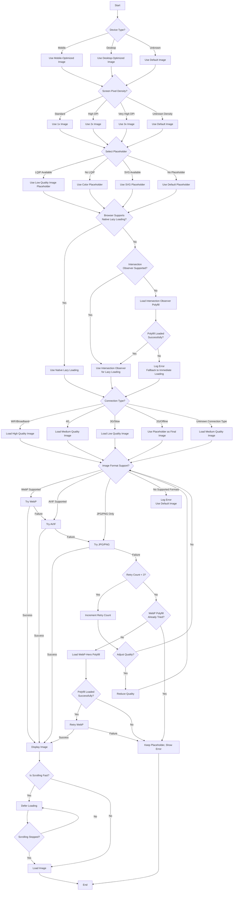

```mermaid
graph TD
    A[Start] --> B{Device Type?}
    B -->|Mobile| C[Use Mobile-Optimized Image]
    B -->|Desktop| D[Use Desktop-Optimized Image]
    B -->|Unknown| E[Use Default Image]
    C --> F{Screen Pixel Density?}
    D --> F
    E --> F
    F -->|Standard| G[Use 1x Image]
    F -->|High DPI| H[Use 2x Image]
    F -->|Very High DPI| I[Use 3x Image]
    F -->|Unknown Density| J[Use Default Image]
    G --> K{Select Placeholder}
    H --> K
    I --> K
    J --> K
    K -->|LQIP Available| L[Use Low Quality Image Placeholder]
    K -->|No LQIP| M[Use Color Placeholder]
    K -->|SVG Available| N[Use SVG Placeholder]
    K -->|No Placeholder| O[Use Default Placeholder]
    L --> P{Browser Supports<br>Native Lazy Loading?}
    M --> P
    N --> P
    O --> P
    P -->|Yes| Q[Use Native Lazy Loading]
    P -->|No| R{Intersection<br>Observer Supported?}
    R -->|Yes| S[Use Intersection Observer<br>for Lazy Loading]
    R -->|No| T[Load Intersection Observer Polyfill]
    T --> U{Polyfill Loaded<br>Successfully?}
    U -->|Yes| S
    U -->|No| V[Log Error<br>Fallback to Immediate Loading]
    Q --> W{Connection Type?}
    S --> W
    V --> W
    W -->|WiFi/Broadband| X[Load High Quality Image]
    W -->|4G| Y[Load Medium Quality Image]
    W -->|3G/Slow| Z[Load Low Quality Image]
    W -->|2G/Offline| AA[Use Placeholder as Final Image]
    W -->|Unknown Connection Type| BB[Load Medium Quality Image]
    X --> CC{Image Format Support?}
    Y --> CC
    Z --> CC
    AA --> CC
    BB --> CC
    CC -->|WebP Supported| DD[Try WebP]
    CC -->|AVIF Supported| EE[Try AVIF]
    CC -->|JPG/PNG Only| FF[Try JPG/PNG]
    CC -->|No Supported Formats| GG[Log Error<br>Use Default Image]
    DD -->|Success| HH[Display Image]
    DD -->|Failure| EE
    EE -->|Success| HH
    EE -->|Failure| FF
    FF -->|Success| HH
    FF -->|Failure| II{Retry Count < 3?}
    II -->|Yes| JJ[Increment Retry Count]
    II -->|No| KK{WebP Polyfill<br>Already Tried?}
    JJ --> LL{Adjust Quality?}
    LL -->|Yes| MM[Reduce Quality]
    LL -->|No| CC
    MM --> CC
    KK -->|No| NN[Load WebP-Hero Polyfill]
    KK -->|Yes| OO[Keep Placeholder, Show Error]
    NN --> PP{Polyfill Loaded<br>Successfully?}
    PP -->|Yes| QQ[Retry WebP]
    PP -->|No| OO
    QQ -->|Success| HH
    QQ -->|Failure| OO
    OO --> RR[End]
    HH --> SS{Is Scrolling Fast?}
    SS -->|Yes| TT[Defer Loading]
    SS -->|No| UU[Load Image]
    TT --> VV{Scrolling Stopped?}
    VV -->|Yes| UU
    VV -->|No| TT
    UU --> RR[End]

```
